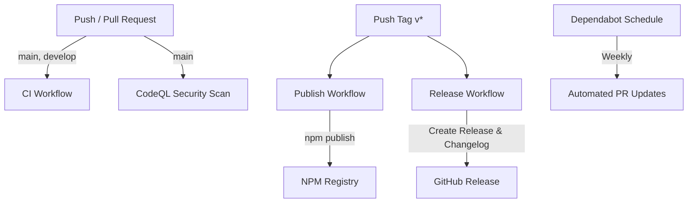

# CI/CD Pipeline Setup & Documentation

Dokumentasi pipeline CI/CD yang telah dikonfigurasi untuk `xenithpay-sdk`.

Dokumentasi ini juga tersedia di [docs/cicd.md](file:///Users/masqomar21/code/job/lib/xenithCore/docs/cicd.md).

---

## 📌 Ringkasan Pipeline

Pipeline CI/CD menggunakan **GitHub Actions** dan **Dependabot** untuk menguji kode secara otomatis pada multiple Node.js versions, mempublikasikan paket ke **NPM Registry**, membuat **GitHub Releases**, dan melakukan pemindaian keamanan dengan **CodeQL**.



---

## 🛠️ Workflows yang Tersedia

### 1. **CI Workflow** (`.github/workflows/ci.yml`)
Berjalan otomatis pada setiap push atau pull request ke branch `main` atau `develop`.

**Fitur:**
- Multi-version testing di Node.js `18.x`, `20.x`, dan `22.x`
- Linting kode menggunakan ESLint
- Running unit test suite dengan Jest
- Build kompilasi TypeScript (`dist/`)
- Upload coverage report ke Codecov (`CODECOV_TOKEN`)

---

### 2. **Publish Workflow** (`.github/workflows/publish.yml`)
Mempublikasikan paket ke npm registry secara otomatis saat git tag rilis di-push.

**Fitur:**
- Linting & testing ulang sebelum publishing
- Build TypeScript
- Automated publish ke `https://registry.npmjs.org` menggunakan `NPM_TOKEN`

**Trigger:** Push git tag dengan format `v*` (contoh: `v1.0.0`, `v0.1.0`)

---

### 3. **Release Workflow** (`.github/workflows/release.yml`)
Membuat GitHub Release secara otomatis saat tag di-push.

**Fitur:**
- Auto-generate changelog dari pesan git commit sejak tag sebelumnya
- Membuat GitHub Release baru dengan release notes dan instruksi instalasi npm

**Trigger:** Push git tag dengan format `v*`

---

### 4. **CodeQL Workflow** (`.github/workflows/codeql.yml`)
Security scanning (SAST) untuk mendeteksi potensi kerentanan keamanan pada kode JavaScript/TypeScript.

**Trigger:**
- Push ke branch `main`
- PR ke branch `main`
- Weekly schedule (Setiap Senin pukul 00:00 UTC)

---

### 5. **Dependabot** (`.github/dependabot.yml`)
Automated dependency update scanner.

**Fitur:**
- Checking update untuk npm packages dan GitHub Actions setiap minggu
- Pembuatan PR otomatis (Max 10 npm PRs, 5 GitHub Actions PRs)

---

## 🔐 GitHub Secrets yang Diperlukan

| Secret Name | Deskripsi | Status |
|---|---|---|
| `NPM_TOKEN` | Token otentikasi npm (Automation type) untuk publish package | **Wajib** |
| `CODECOV_TOKEN` | Token repositori dari Codecov untuk upload coverage report | Opsional |

---

## 🚀 Cara Melakukan Release Baru

1. **Update versi di `package.json` & buat tag:**
   ```bash
   # Pilih jenis bump: patch, minor, atau major
   npm version patch
   ```

2. **Push tag ke GitHub:**
   ```bash
   git push origin main --tags
   ```

3. **Monitor Workflow:**
   GitHub Actions akan secara otomatis menjalankan workflow **Publish to NPM** dan **Create Release**.
