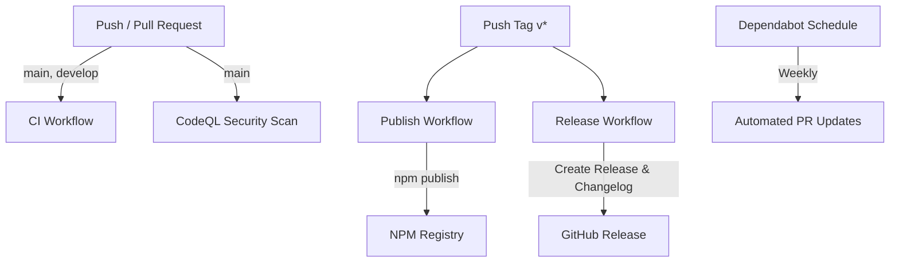

# CI/CD Pipeline Documentation

Dokumentasi lengkap mengenai alur kerja dan konfigurasi **CI/CD (Continuous Integration & Continuous Deployment)** pada repository `xenithpay-sdk`.

---

## 📌 Ringkasan Pipeline

Pipeline CI/CD pada proyek ini dibangun menggunakan **GitHub Actions** dan **Dependabot** untuk menjamin kualitas kode, keamanan, serta otomatisasi rilis paket ke NPM Registry dan GitHub Releases.



---

## 🛠️ Workflows

### 1. Continuous Integration (`.github/workflows/ci.yml`)

Workflow ini bertujuan memastikan bahwa setiap perubahan kode diuji dan dibangun dengan sukses pada berbagai versi Node.js.

* **Trigger**:
  * `push` ke branch `main` atau `develop`
  * `pull_request` ke branch `main` atau `develop`
* **Jobs**:
  1. **Test Matrix**:
     * **Environment**: `ubuntu-latest`
     * **Node.js Matrix**: `18.x`, `20.x`, `22.x`
     * **Langkah**:
       1. `actions/checkout@v4` — Checkout source code.
       2. `actions/setup-node@v4` — Setup Node.js dan npm cache.
       3. `npm ci` — Install dependencies secara bersih.
       4. `npm run lint` — Menjalankan ESLint scanner.
       5. `npm test` — Menjalankan unit test suite dengan Jest.
       6. `npm run build` — Kompilasi TypeScript ke `dist/`.
  2. **Coverage**:
     * **Node.js**: `20.x`
     * **Langkah**:
       1. `npm test -- --coverage` — Menghasilkan laporan coverage.
       2. `codecov/codecov-action@v4` — Mengirimkan data coverage ke Codecov (`CODECOV_TOKEN`).

---

### 2. NPM Publishing (`.github/workflows/publish.yml`)

Workflow ini mempublikasikan paket SDK ke registry official NPM secara otomatis ketika rilis versi baru ditandai.

* **Trigger**: `push` tag yang diawali dengan `v` (contoh: `v1.0.0`, `v0.1.2`).
* **Permissions**: `contents: read`, `id-token: write`
* **Langkah Execution**:
  1. `actions/checkout@v4`
  2. Setup Node.js `20.x` dengan `registry-url: 'https://registry.npmjs.org'`
  3. `npm ci`
  4. `npm run lint` & `npm test`
  5. `npm run build`
  6. `npm publish` — Menggunakan secret `NPM_TOKEN`.

---

### 3. Automated Release & Changelog (`.github/workflows/release.yml`)

Workflow ini membuat halaman **GitHub Release** secara otomatis lengkap dengan changelog berdasarkan daftar komit git sejak rilis sebelumnya.

* **Trigger**: `push` tag `v*`.
* **Permissions**: `contents: write`
* **Langkah Execution**:
  1. Checkout repository dengan full depth (`fetch-depth: 0`).
  2. **Generate Changelog**:
     * Mengidentifikasi tag versi sebelumnya.
     * Mengambil log komit antara tag lama dan tag baru (`git log PREV_TAG..HEAD`).
  3. **Create GitHub Release**:
     * Memakai `actions/create-release@v1`
     * Mengisi *Release Notes* dengan daftar komit dan petunjuk instalasi paket npm.

---

### 4. CodeQL Security Analysis (`.github/workflows/codeql.yml`)

Workflow analisis keamanan statis (SAST) untuk mendeteksi potensi kerentanan keamanan dan *code smell*.

* **Trigger**:
  * Push ke branch `main`
  * Pull Request ke branch `main`
  * Schedule Cron: Setiap hari Senin pukul `00:00 UTC`
* **Language Target**: JavaScript / TypeScript

---

### 5. Automated Dependency Updates (`.github/dependabot.yml`)

Konfigurasi Dependabot untuk menjaga keterbaruan dependensi proyek secara otomatis.

* **Pemeriksaan Mingguan**:
  * **npm dependencies**: Maksimal 10 Pull Request terbuka sekaligus.
  * **GitHub Actions dependencies**: Maksimal 5 Pull Request terbuka sekaligus.
* **Reviewer/Assignee**: `@masqomar21`

---

## 🔐 Configuration & Secrets

Agar seluruh pipeline CI/CD berjalan dengan lancar, pastikan Repository Secrets berikut dikonfigurasi di GitHub (**Settings > Secrets and variables > Actions**):

| Secret Name | Deskripsi | Required |
|---|---|---|
| `NPM_TOKEN` | Token otentikasi NPM (Automation type) untuk publish package | **Wajib** |
| `CODECOV_TOKEN` | Token repositori dari Codecov untuk upload coverage report | Opsional |
| `GITHUB_TOKEN` | Generated otomatis oleh GitHub Actions (membutuhkan permission `contents: write`) | Bawaan System |

---

## 🚀 Panduan Melakukan Release SDK

Ikuti langkah-langkah berikut ketika ingin mempublikasikan versi baru dari SDK:

### 1. Bump Version
Jalankan salah satu perintah berikut untuk menaikkan versi paket di `package.json` dan membuat git tag secara otomatis:

```bash
# Untuk perbaikan bug (0.0.x)
npm version patch

# Untuk fitur baru yang tidak breaking change (0.x.0)
npm version minor

# Untuk perubahan besar / breaking change (x.0.0)
npm version major
```

### 2. Push Tag ke Remote Repository
Kirimkan komit versi dan tag baru ke remote Git:

```bash
git push origin main --tags
# atau push tag spesifik:
# git push origin v1.0.1
```

### 3. Pantau Eksekusi Pipeline
1. Buka tab **Actions** di repositori GitHub.
2. Workflow **Publish to NPM** dan **Create Release** akan berjalan secara beriringan.
3. Setelah selesai, cek paket rilis di [npmjs.com](https://www.npmjs.com/) dan tab **Releases** pada repository GitHub.

---

## 🔍 Troubleshooting & Pertanyaan Umum

#### ❓ Publish gagal dengan error 401 Unauthorized / OTP
* Pastikan `NPM_TOKEN` yang dimasukkan ke GitHub Secrets berjenis **Automation Token** (Granular Access Token / Classic Automation Token tanpa syarat 2FA saat dipanggil via script).

#### ❓ Tag dipush tetapi Workflow Publish/Release tidak berjalan
* Pastikan penamaan tag menggunakan awalan `v`, contohnya `v1.0.0`. Tag seperti `1.0.0` (tanpa `v`) tidak akan mentrigger workflow publish.

#### ❓ Release workflow gagal membuat rilis di GitHub
* Periksa **Workflow Permissions** repositori di **Settings > Actions > General > Workflow permissions**, pastikan terpilih **"Read and write permissions"**.
